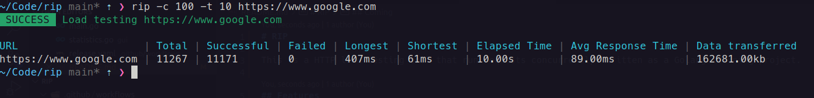

# RIP

This is a HTTP load testing tool that run requests concurrently. Written as a Golang learning project.



## Features

-   Run requests concurrently
-   Set a timer in second for how long it should run
-   Outputs table of statistics for the end result

## Coming

-   JSON output of the result
-   Support multiple URLs

## Usage

Install the binary from <https://github.com/bjarneo/rip/releases>, or go directly to the build the binary manually step.

```bash
$ rip -c 100 -t 10 https://your.domain.com
```

### The default values

```
Usage of rip
  -t int
    How many seconds to run the test (default: 60)
  -c float
    How many concurrent users to simulate (default: 10)

```

## Get it up and running [DEV]

```bash
# Install dependencies
go install

# By using the go binary directly
go run main.go
```

## Build the binary manually

```bash
# Build binary
go build

# Now it will be available as "rip"
rip http://localhost:1337
```

## Troubleshooting

If you get this error message `socket: too many open files`, you might want to increase your ulimit to a higher number.

```bash
ulimit -n 12000
```

## LICENSE

See [LICENSE](./LICENSE)
