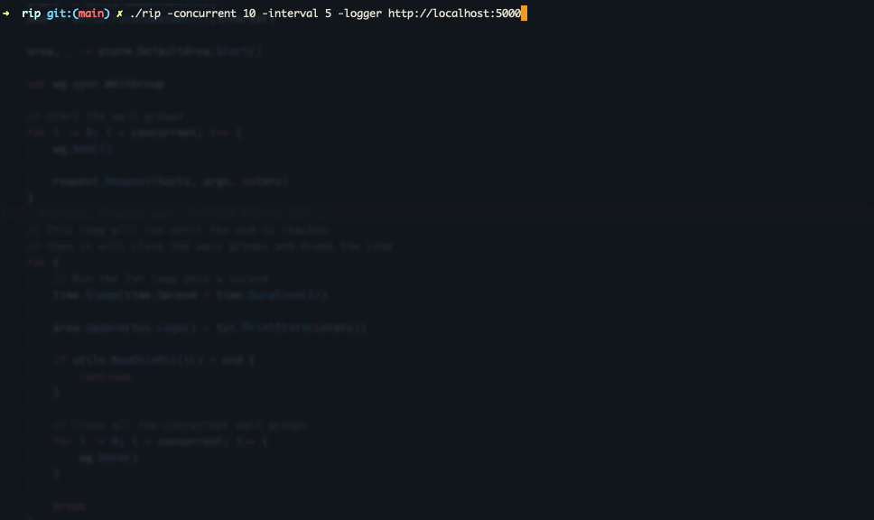

# RIP

This is a HTTP load testing and UDP flood attack tool that run requests concurrently.

Note: I am using this project as a Go learning project. Refactors will most likely happen often.

Looking for new features? Create an issue.



## Features

- HTTP load testing
- UDP flood attack
- Run requests concurrently
- Set an interval in seconds
- Continuous statistics output
- Log the requests to $HOME/rip.log
- Supports multiple hosts
- POST/PUT/PATCH HTTP requests
- HTTP JSON payload
- Custom HTTP headers
- Proxy HTTP requests
- Limit the requests per concurrent user

## Coming

- UDP payload attachment
- Form data payload
- JSON output of the result

## Usage

Install the binary (windows, osx, linux) from <https://github.com/bjarneo/rip/releases>, or go directly to the build the binary manually step.

```bash
#### Standard by using one host
rip -concurrent 100 -interval 10 https://your.domain.com

#### Multiple hosts
touch hosts.txt

# Add the content, important that each host is on a newline
http://localhost:5000
http://localhost:5000/dis-is-nice
http://localhost:5000/yas

# RIP
rip --interval=10 --hosts=hosts.txt

#### Using UDP flood attack
rip --interval=10 --concurrent=10 --udp --udp-bytes=4096 0.0.0.0:30000

#### Using a JSON payload for POST requests
rip --interval=10 --concurrent=10 --post --json=payload.json http://localhost:5000/login

#### Example using custom headers
touch headers.txt

# Add the content
X-Real-Ip: 192.168.0.1
Authorization: Basic aGV5OnlvdQo=

# RIP
rip --interval=10 --concurrent=10 --headers=headers.txt http://localhost:5000
```

### The default values

```bash
Usage of RIP
  --concurrent int
        How many concurrent users to simulate (default 10)
  --requests int
        Max requests per concurrent user at a time (default 0 which means disabled)
  --hosts string
        A file of hosts. Each host should be on a new line. It will randomly choose a host. (default "")
  --headers string
        Path to the headers file (default "")
  --interval int
        How many seconds to run the test (default 60)
  --json string
        Path to the JSON payload file to be used for the HTTP requests (default "")
  --logger bool
        Log the requests to $HOME/rip.log (default false)
  --patch bool
        PATCH HTTP request (default false)
  --post bool
        POST HTTP request (default false)
  --put bool
        PUT HTTP request (default false)
  --proxy string
        The proxy URL to route the traffic (default "")
  --udp bool
        Run requests UDP flood attack and not http requests (default false)
  --udp-bytes int
        Set the x bytes for the UDP flood attack (default 2048)


```

## Get it up and running [DEV]

```bash
# Install dependencies
go install

# By using the go binary directly
go run main.go
```

## Build the binary manually

To use the bleeding edge codebase, this is the way.

```bash
# Build binary
go build

# Now it will be available as "rip"
rip http://localhost:1337
```

## Troubleshooting

If you get this error message `socket: too many open files`, you might want to increase your ulimit to a higher number.

```bash
ulimit -n 12000
```

## Disclaimer

Use this tool at your own risk. The owner of this repository is not responsible for its usage.

## LICENSE

See [LICENSE](./LICENSE)
